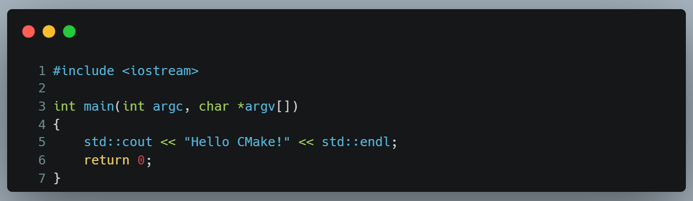
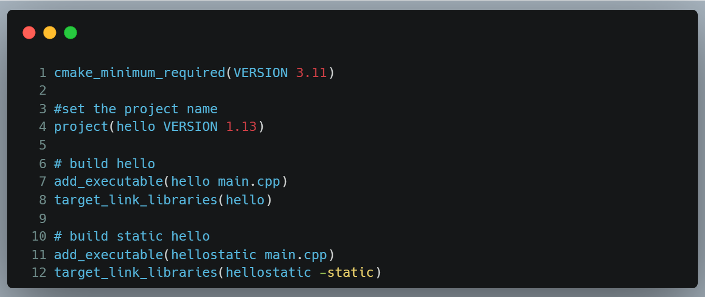

# Day01 初识CMake-第一个CPP工程案例

### 1、源码目录树

```bash
hello01/
├── CMakeLists.txt
├── README.md
├── auto_build_linux.sh
├── auto_build_linux_normal.sh
├── build
│   ├── CMakeCache.txt
│   ├── CMakeFiles
│   ├── Makefile
│   ├── cmake_install.cmake
│   ├── hello
│   └── hellostatic
└── main.cpp
```

### 2、main.cpp



### 3、CMake & Gcc等工具集

```bash
$ sudo apt install -y vim curl wget git net-tools  build-essential p7zip-full cmake
```

### 4、CMakeLists.txt



### 5、auto_build_linux.sh


### 6、编译和运行

```bash
$ sh auto_build_linux.sh

-- Configuring done (0.1s)
-- Generating done (0.2s)
-- Build files have been written to: /mnt/e/project/caetraining/vtk-tutorials/hello01/build
[ 50%] Built target hello
[100%] Built target hellostatic

$  cd build 
$  ./hello 
```
